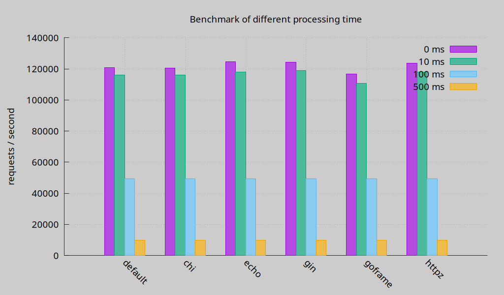

> httpz v1.0.0 is release, its API is stable.

**[简体中文](https://github.com/aeilang/httpz/blob/main/README_CN.md)**

httpz is not a new framework but rather an enhancement library for net/http. When you use httpz, you’re essentially working with the net/http standard library. Its goal is to address the usability gap in net/http 1.22, which, despite its improved routing capabilities, remains less convenient compared to frameworks like Echo and chi.

Key Features:
- Built on net/http version 1.22+
- Global error handling
- Convenient grouping
- Middleware adopted from chi
- Data binding adopted from Echo
- Easy response shortcuts

httpz is fully compatible with net/http. You can choose to leverage the enhanced features of httpz or stick to using plain net/http directly.

# Quick Start

## 1.Installation

To install httpz, Go 1.22 or higher is required.

```sh
go get github.com/aeilang/httpz
```

## 2.Hello World

```go
import (
	"net/http"

	"github.com/aeilang/httpz"
	"github.com/aeilang/httpz/middleware"
)

func main() {
	// Create a new mux
	mux := httpz.NewServeMux()

	// add logger middleware, it 's copy from chi/middleware
	mux.Use(middleware.Logger)

	// register a GET /hello route
	// GET /hello
	mux.Get("/hello", func(w http.ResponseWriter, r *http.Request) error {
		// rw is a helper responsewriter to send response
		rw := httpz.NewHelperRW(w)
		return rw.String(http.StatusOK, "hello httpz")
		
		// or you can write it by yourself.
		// hw.Header().Set("Content-Type", "text/plain; charset=UTF-8")
		// hw.WriteHeader(http.StatusOK)
		// hw.Write([]byte("hello httpz"))
		// return nil
	})
  
  // just like net/http's ServerMux
	http.ListenAndServe(":8080", mux)
}
```

> the middleware package is copied from chi/middleware. 

The complete example can be found in the [_example](https://github.com/aeilang/httpz/blob/main//example/hello/main.go) directory

# Benchmark

Generated by [Go web framework benchmark](https://github.com/smallnest/go-web-framework-benchmark):



For detailed benchmark results, please refer to [benchmark](https://httpz.vercel.app/en/docs/benchmark).


# Feel free to contribute your code.

- test

- example

- middleware

- other
