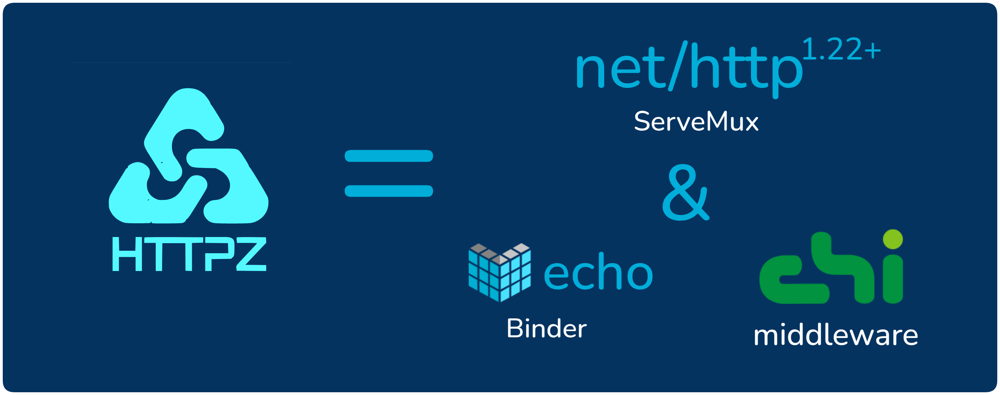
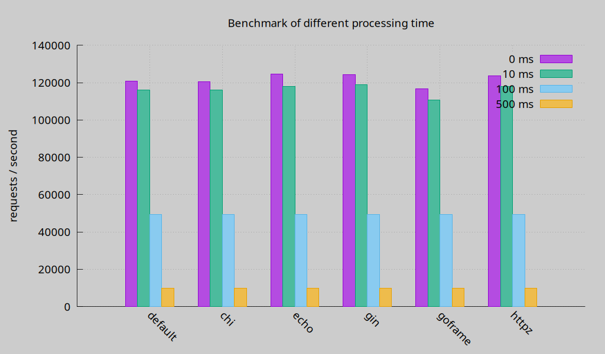

> httpz v1.0.0 版本已经发布，它的API已经稳定

httpz只是net/http的增强库，而不是新的框架。使用httpz，实际上就是使用net/http标准库进行开发。它要解决的问题是，
net/http 1.22 虽然增强了路由功能，但使用不如 Echo 和 chi 等框架方便。

它具有以下特性：

1. 以net/http 1.22+版本为基础
2. 全局错误处理
3. 便捷的分组
4. 来自chi的中间件
5. 来自Echo的数据绑定
6. 快捷返回响应

httpz完全兼容net/http， 你可以选择使用httpz的增强功能，或者直接使用net/http。

# 快速开始

## 1.安装

要安装 httpz，需要 Go 1.22+

```sh
go get github.com/aeilang/httpz
```

## 2.Hello World

```go
import (
	"net/http"

	"github.com/aeilang/httpz"
	"github.com/aeilang/httpz/middleware"
)

func main() {
	// Create a new mux
	mux := httpz.NewServeMux()

	// add logger middleware, it 's copy from chi/middleware
	mux.Use(middleware.Logger)

	// register a GET /hello route
	// GET /hello
	mux.Get("/hello", func(w http.ResponseWriter, r *http.Request) error {
		// rw is a helper responsewriter to send response
		rw := httpz.NewHelperRW(w)
		return rw.String(http.StatusOK, "hello httpz")
		
		// or you can write it by yourself.
		// hw.Header().Set("Content-Type", "text/plain; charset=UTF-8")
		// hw.WriteHeader(http.StatusOK)
		// hw.Write([]byte("hello httpz"))
		// return nil
	})
  
  // just like net/http's ServerMux
	http.ListenAndServe(":8080", mux)
}
```

> middleware 包来自chi/middleware

完整的hello world例子在 [example](https://github.com/aeilang/httpz/blob/main//example/hello/main.go) 目录

# 基准测试

由 [Go web framework benchmark](https://github.com/smallnest/go-web-framework-benchmark)生成:



详细的基准测试请查看[benchmark](https://httpz.vercel.app/cn/docs/benchmark)

# 欢迎贡献你的代码

- test

- example

- middleware

- other
